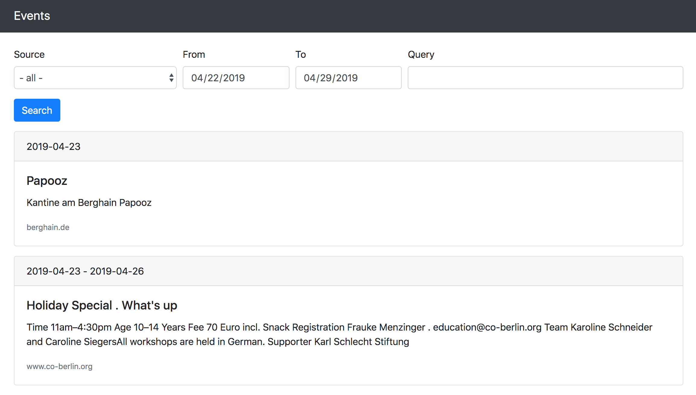

### README

Thank you for being able to take up the challenge and practice in designing this simple app.

I have selected these sources to parse http://berghain.de/events/ and https://www.co-berlin.org/en/calender/

Rails is a framework of my choice for this app, because of its extensive conventions.
Parsers have been implemented as service objects. They are run by ActiveJob, and Whenever gem, to make them asynchronous and recurring. Whenever gem is an excellent option for production as it generates crontabs (no additional ruby daemons).
HTML is parsed using Nokogiri gem with CSS selectors.
I used RSpec for testing.
I used Bootstrap as a CSS framework (nicely looking prototype is always better).
I have included my local config for Foreman gem. It is in Procfile.dev.

I would be happy if you run my app!

I assumed that source events are posted frequently and don't get updated after being published.

What else can be done:
- More data can be parsed from the sources. It includes detailed descriptions and exact dates. Images can be downloaded and put to S3
- Parsers can process errors more intelligently and signal about them in some way. For now, they raise them, which is clear enough
- More intelligent data processing can be used to skip events from the past. For now, the system tries to add an event if it is not in the database
- Another possible improvement - processing event lists with pagination. This approach will be necessary to get initial data from the event sites
- There always can be more tests :)

Finally. Here is the image of the UI

